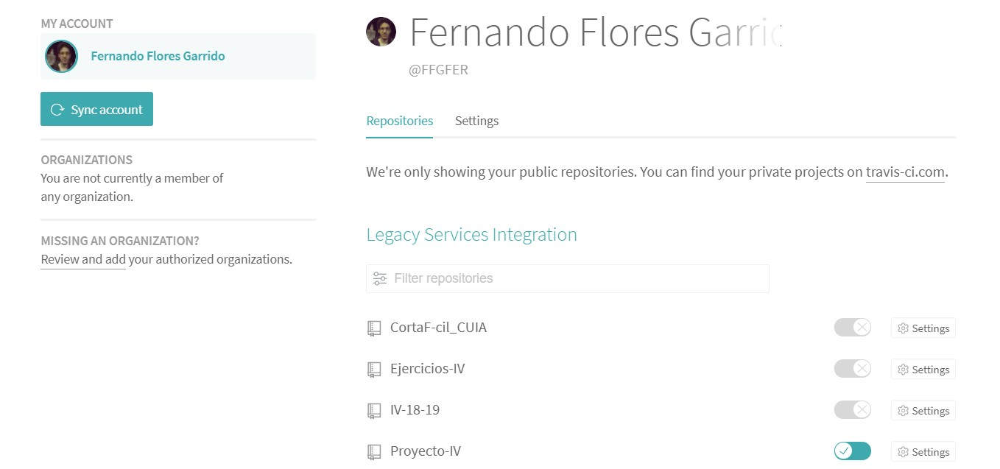
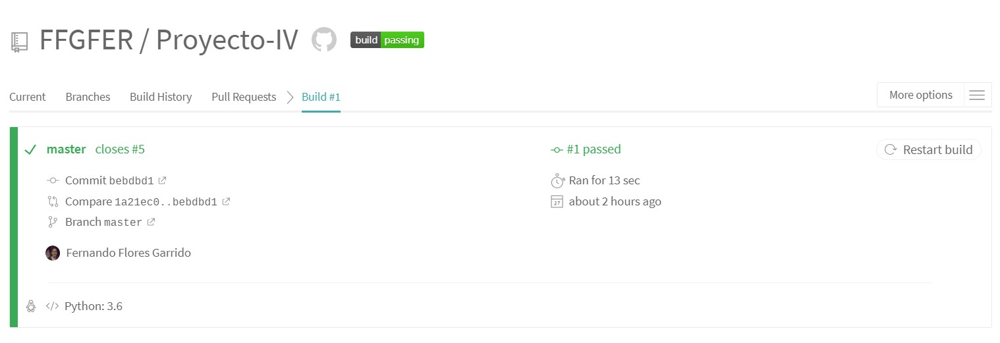

# Hito 2
Para añadir integración continua a nuestro proyecto hemos seguido los siguientes pasos:

## Paso 1
Diseñamos los tests que queremos que prueben nuestro futuro código: [testvg.py](https://github.com/FFGFER/Proyecto-IV/blob/master/src/testvg.py) y [testvg.usr](https://github.com/FFGFER/Proyecto-IV/blob/master/src/testusr.py)

## Paso 2
Añadimos el [archivo de configuración de Travis](https://github.com/FFGFER/Proyecto-IV/blob/master/.travis.yml) y un [makefile](https://github.com/FFGFER/Proyecto-IV/blob/master/Makefile) que ejecute los tests. También dejamos creado el archivo [requirements.txt](https://github.com/FFGFER/Proyecto-IV/blob/master/requirements.txt) pero por ahora no tenemos dependencias.

## Paso 3
Configuramos Travis desde su sitio web para que monitorice los commits y pull requests de nuestro repositorio:

## Paso 4
Añadimos las clases [videojuegos.py](https://github.com/FFGFER/Proyecto-IV/blob/master/src/videojuegos.py) y [usuarios.py](https://github.com/FFGFER/Proyecto-IV/blob/master/src/usuarios.py), así como los archivos JSON [videojuegos.json](https://github.com/FFGFER/Proyecto-IV/blob/master/src/videojuegos.json) [usuarios.json](https://github.com/FFGFER/Proyecto-IV/blob/master/src/usuarios.json) a nuestro repositorio para que sean testeadas por Travis:

